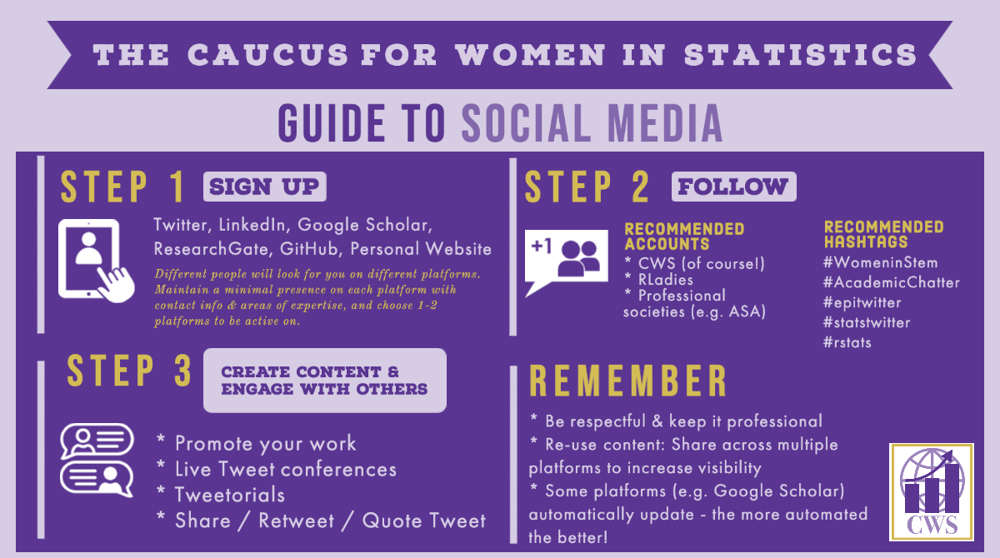

In March 2020, I moderated the [Caucus for Women in Statistics](https://cwstat.org/march-31st-lunch-learn-on-creating-a-professional-online-presence-view-recording/) (CWS) Lunch & Learn on creating a professional online presence & navigating social media, in which Drs. [Ellie Murray](https://twitter.com/EpiEllie), [Claire Bowen](http://www.clairemckaybowen.com/) & [Sam Tyner](https://sctyner.github.io/) shared their experience navigating the multitude of platforms available for managing your presence online. In this blog post  will highlight the key discussion points and takeaways. The full video of the Lunch & Learn is available [here.](https://cwstat.org/march-31st-lunch-learn-on-creating-a-professional-online-presence-view-recording/)

### Creating a professional online presence

Having a professional online presence allows people to easily find you and identify your areas of expertise. Though always important, having information online that showcases your research skills and areas of expertise is especially important when searching for a job and submitting a grant, when people may be looking into your background a bit more closely. Having a professional online presence helps to legitimize an application, and also allows journalists to find you when they are looking for experts in your field. 

### Which platforms?

Twitter, LinkedIn, ResearchGate, Google Scholar, GitHub, and personal websites are among the places you may consider for creating an online presence. 

The panel recommended having at least a minimal presence on each platform with information about your main areas of expertise and how to contact you. The rationale is that different people will look for you on different platforms; journalists may find you one way, potential employers another, and colleagues yet another. While it would be daunting to manually maintain an active presence on each platform, establishing a minimal platform on each and choosing one to two to be active on is much more manageable. The more automated the better. Platforms like [Google Scholar](https://scholar.google.com/) and [ResearchGate](https://www.researchgate.net/) automatically update to add your recent publications. 

### Personal websites & online resumes

There are a few options for creating and hosting a personal website. The Live Free or Dichotomize blog provides a great tutorial on [How to make an R Markdown website (with RStudio!)](https://livefreeordichotomize.com/2017/08/08/how-to-make-an-rmarkdown-website/) and [GitHub](https://pages.github.com/) or [Netlify](https://yihui.org/en/2017/06/netlify-instead-of-github-pages/). For those wishing to get into more customizability, Dr. Bowen created her [website](http://www.clairemckaybowen.com/) using HTML and CSS, and used [bluehost](https://www.bluehost.com) for her website. 

At a minimum, your personal website should include your contact information and areas of expertise. Bonus points if it also includes your CV, a blog, links to previous talks that you've given, and a bit about you personally. The personal component gives interviewers and colleagues insight into who you are as a person beyond your professional profile, and often generates some interesting topics for discussion during an interview. 

[Dr. Sam Tyner's resume](https://sctyner.github.io/static/resume/tyner-cv-pd.html) is a great example of what you can do with blogdown::pagedown in R. I was so inspired by hers, [I created one myself](http://www.jessicalavery.com/files/lavery_pagedown_resume.html)!

### Content

The panelists didn't have separate personal and professional social media accounts on the same platform (i.e. a professional Twitter and a personal Twitter). That said, they pointed out that all of your accounts don't have to be both personal *and* professional. It's okay to keep some platforms entirely personal (such as Facebook and Instagram), but if you are going to use a platform as *both* personal and professional, it's important to be mindful of the content you are sharing. Dr. Murray remembered that when she first started using Twitter, her first followers were her PhD adviser and her mom, and those were her guideposts for determining what kind of content she wanted to share. 

Rather than generating content for each platform individually, it's most efficient to re-use material across platforms, especially because there are different audiences on each platform. For example, write a Tweetorial about something that you're already working on or to promote a longer form Medium post or blog post. This helps to reduce the number of hours spent working on your online presence, while still increasing your visibility. 

It can be a bit intimidating to break into social media and figuring out what thoughts to put out into the world. Dr. Bowen shared that one way to start to get comfortable is to find your niche (in statistics, this might include the American Statistical Association, the Caucus for Women in Statistics, RLadies, #epitwitter, and #AcademicChatter). Once you've found this group, a safe place to start is by sharing the content that they have already posted and building up to sharing your own content. Dr. Murray pointed out that it's okay to start simple. There's a wide audience on the Internet, providing an opportunity to start wherever you feel comfortable. 

### What's a Tweetorial?

A Tweetorial = a tutorial on Twitter. Dr. Murray is the queen of tweetorials, and I highly recommend checking out her Tweetorials on [simulation models for causal inference (feat. Baby Yoda)](https://twitter.com/EpiEllie/status/1225542654009761792?s=20) and the [difference between left truncation and left censoring](https://twitter.com/EpiEllie/status/1145397277437169672?s=20). Think those ideas can't be explained in a Twitter thread? Think again. I asked about the secrets to creating a Tweetorial and learned about a few key concepts:

1. The first tweet should capture the audience's attention. Make it fun via GIFs, photos, etc. 

2. Each Tweet should contain a single idea so that others can share them individually. 

3. A picture is worth a thousand words. Communicating complex information in 280-character sound bytes can be complicated, but utilizing images and GIFs can help convey a message.

### Navigating Challenges that Arise

When becoming more visible online, it's almost inevitable that some disagreements will arise and the internet trolls will emerge. 

Dr. Murray said that the with a small number of characters available per post on Twitter in particular, it's possible that people are coming across as harsher than intended. A majority of the time, giving people this benefit and responding accordingly resolves any potential tension and prevents an interaction from escalating. 

Dr. Tyner shared the wisdom that the mute button is your friend saying to, "Mute early and often." She also recommended putting your degree in your Twitter name to automatically demonstrate expertise. Dr. Murray lists her pronouns as "she, her, Dr" on Twitter as a clever way to get this point across. 

### Summary 

A huge thank you to Drs. [Ellie Murray](https://twitter.com/EpiEllie), [Claire Bowen](http://www.clairemckaybowen.com/) & [Sam Tyner](https://sctyner.github.io/) for sharing their thoughts on creating a professional online presence and navigating social media for the March Caucus for Women in Statistics Lunch & Learn. Check out the [recording](https://cwstat.org/march-31st-lunch-learn-on-creating-a-professional-online-presence-view-recording/) and visual summary below of the panel's fantastic recommendations, and visit the [Caucus for Women in Statistics website](www.cwstat.org) for information about future Lunch & Learns!

